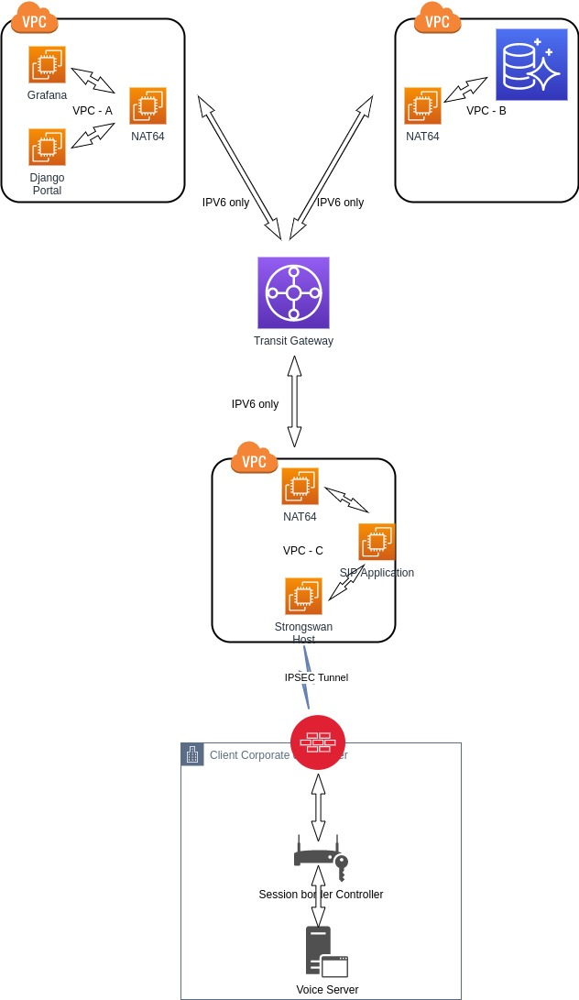
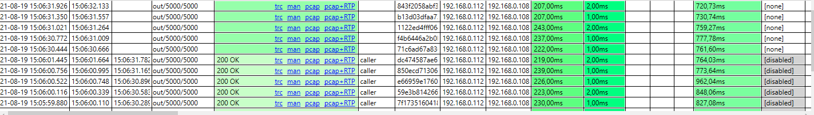
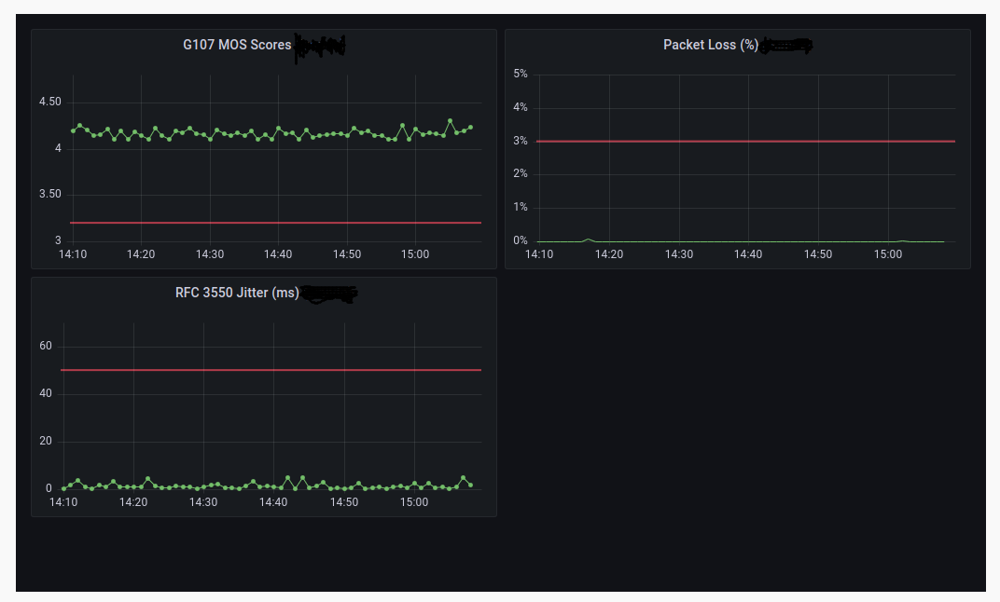

---

## Voice Quality Monitoring

This is a development project to perform voice quality monitoring & reporting

### Project Overview:
The Custom Voice Quality Monitoring System (VQMS) aims to enhance call quality analysis and troubleshooting within the Avaya call center platform. This solution will provide real-time and historical insights into voice quality, enabling proactive issue resolution and improved customer experience.

---

### Objectives:

* Implement a real-time voice quality monitoring solution for Avaya call center agents.
* Integrate key voice quality parameters such as MOS (Mean Opinion Score), Jitter, Packet Loss, and Latency.
* Provide automated alerts and reports for degraded call quality incidents.
* Enable seamless integration with existing Avaya infrastructure and third-party analytics tools.
* Ensure compliance with industry standards and regulatory requirements.

---

### Scope:

#### In-Scope:

* Deployment of a real-time monitoring dashboard.
* API-based integration with Avaya Call Management System (CMS) and VoIP monitoring tools.
* Historical reporting and trend analysis.
* Configuration of alert thresholds and notification mechanisms.
* Security and compliance adherence for data handling.

#### Out of Scope:

* Replacement of existing Avaya infrastructure.
* Development of a new telephony platform.

---

### Key Stakeholders:

* Project Sponsor
* IT & Network Teams
* Call Center Operations
* Security & Compliance Teams
* Vendor & Third-Party Service Providers

---

### Deliverables:

* Functional requirements document
* System architecture and design plan
* Implementation of monitoring and alerting tools
* User training and documentation
* Go-live and post-implementation support

---

### Timeline:

| Phase | Duration | Key Milestones |
|-------|----------|----------------|
| Planning | 4 weeks | Requirements gathering, design approval |
| Development | 8 weeks | System build, integration testing | 
| Deployment | 4 weeks | Pilot rollout, adjustments |
| Go-Live | 2 weeks | Full deployment, user training |
| Optimization | Ongoing | Continuous improvement, monitoring |

---

### Budget & Resources:

* Capex budget
* Required resources:
  * Avaya specialists
  * Network engineers
  * Software developers
  * Security analysts

---

### Risk Assessment:

| Risk Factor | Impact | Mitigation Strategy |
| Integration complexity| High | Engage Avaya experts early, conduct thorough testing |
| Data security risks | Medium | Implement encryption, access controls, and compliance audits | 
|Performance issues | Medium | Conduct stress testing, optimize network infrastructure | 

---

### Success Criteria:

* Accurate and timely monitoring of voice quality metrics.
* Reduction in call quality-related complaints.
* Enhanced troubleshooting capabilities for IT teams.
* Seamless integration with Avaya and third-party tools.

---

### Implementation

#### Description

This project consist of a number of AWS platforms and components as follows:
1. Multiple VPC's (VPC-A - Shared Services (Grafana, Django Portal etc), (VPC-B - Unified Comms - Aurora DB etc), (VPC-C - Client Connectivity Pod + SIP application) 
2. Multiple EC2 instances (SIP App host, Strongswan Host, NAT64 Hosts, Grafana Host)
3. a Transit Gateway - to interconnect VPC's via IPV6 only!
4. an Aurora MySQL instance - for storing Voice CDR record

---

#### Architecture

The Network Architecure is depicted below:

---

The system operates as follows:
1. The SIP Application - commercial software, so not going to mention it by name here - connects to the client's enterpise voice environment. This enterprise voice environment consist of a number of components, yet have been simplified for purpose of this description. The primary purpose of the SIP Application is to run synthetic voice calls across the entire SIP path being used by the clients call centre environment, and collecting the associated CDR records to ensure the voice quality across the managed components provided by the voice manged services provider are within agreed limits.
2. The SIP application acts as both the dailer(orginator) and as dialed receiver) parties, to fully emulate the experience of a call centre customer dialing into the call centre, as well as the call center agent receiving this voice call. As part of the synthetic call, a sound file is played, to create sound amplitude across both the channels for send and receive audio as part of the simulated call experience.
3. The backend component of the SIP Application is connected with an MySQL ODBC driver to an Aurora MySQL database to capture all of the call experience metric data received from the CDR records 
4. The user frontend of this solution is a Grafana Dashboard created on Grafana 8, installed on a small EC2 instance - t3-micro. which is connected to the Aurora MySQL instance. 
5. The Grafana dashboard is presented as an embedded panel within a Django portal to allow the Voice engineers that are based on client site to log into the portal via Active Directory federation, in order to be able to browse the Grafana voice quality metrics graphs.
6. The NAT64 hosts are being used to translate and enable the IPV4 connectivity to the Aurora DB across the Transit Gateway's IPV6 only links between the VPC's 

---

#### CDR Records in SIP Application

   
---

#### Grafana Dashboard of SIP Metrics

---
